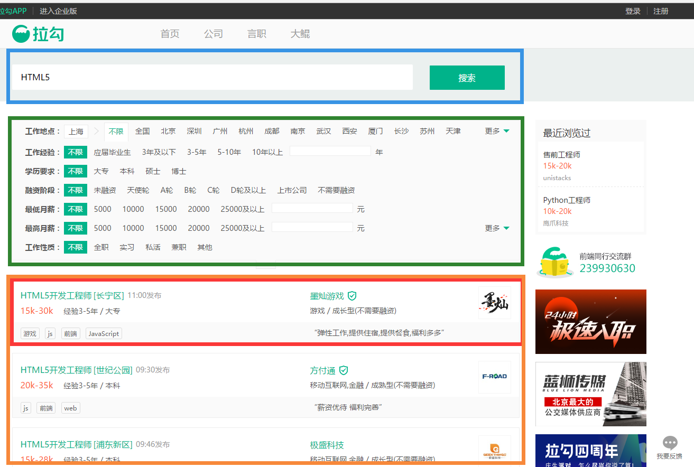

首页demo图如下


```
home.vue    //首页
|
|-- search.vue    //搜索框（蓝色）
|-- selector.vue    //筛选条件框（绿色）
|-- Listview.vue    //列表展示区域（橙色）
|   |
|   |-- listItem.vue    //单个展示组件（红色）
|   |-- Pagination.vue    //分页组件（未显示）
```


<h2>各组件功能：</h2>
<h3>**selector.vue**</h3>
1. 绿色区域，条件选择器功能的实现；
2. 负责提供搜索条件；
3. 暴露接口getSelector()，返回值是当前选择的情况，数据的组成方式请严格按照文档来实现；
4. 选择器选择状态在变更之后（比如用户点选），触发``/selector/change``事件，传递参数是当前选择器的状态（同3）；

<h3>**search.vue**</h3>
1. 蓝色区域，根据输入框发起ajax搜索；
2. 调用**selector.vue**的接口getSelector()，并和搜索框输入内容组合，然后调用公有ajax函数发起搜索；
3. ajax之前触发``/search/joblist/search``事件，参数为搜索条件对象；
4. 请注意防止连续请求；
5. 本组件不负责对搜索结果进行处理
